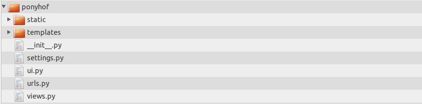
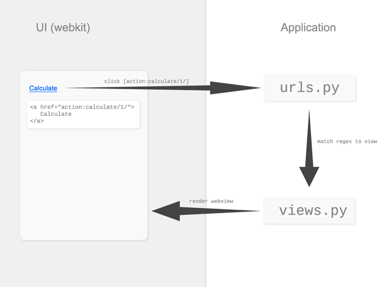

###################################
Understanding webkitpony
###################################

*********************
Project structure
*********************

A webḱitpony project follows a django-inspired structure. The following figure shows
the example project _ponyfarm_:

As you can see, the structure is quite similar to the one of a django project.
Let's start with a brief overview:

* ``urls.py``: contains a list of tuples matching a regular expression representing a url to a view function.
* ``views.py``: contains the view functions referenced in the ``urls.py`` module.
* ``settings.py``: contains your project's settings like e.g. if to enable the webkit inspector or the default window size.
* ``ride.py``: the starting point for riding your pony: ``python ride.py``.
* ``templates``: contains your templates with jinja2 template syntax available.
* ``static``: contains the static files of your project like e.g. css and javascript.

Those who are familiar with django might already have become an idea of the webkitpony principle. 

****************************
HTML - Python Interaction
****************************

To understand webkitpony, it is important to understand the communication between web ui and python code:

On the left hand side we have the webkit (represented as a webview object), which we'll call UI. On the right hand
side we have the python application.

Whenever a link is clicked, the url of that link, namely the href
attribute is sent to the webkitpony url dispatcher, which looks up the url patterns
and triggers the view, passing the webview and the passed url parameters. 

****************************
A full example
****************************

As in the figure we saw before, the html contains a button "calculate". Note that all links are prefixed with 'action:'
which is used to distinguish between referencing urls and files. 

:: 

    <body>
        <a id="calculate" href="action:/calculate/1/">Calculate</a>
    </body>

The ``urls.py`` module defines a variable ``urlpatterns`` similar to django. It consits of tuples of a
regular expression matching potential incoming urls and a callback to be invoked when this regex matches. The grouped
regex is passed as parameter to the callback view function.

::
 
    urlpatterns = (
        (r'^calculate/(?P<id>[0-9]+)/$', views.calculate)
    )
    
    
The ``views.py`` module defines the view previously registered on the calculate url. The first paramter is always
the ``webview`` object representing the webkit. Further parameters depend on the pattern. In this example ``id`` is passed.

::

    def calculate(webview, id):
        # do some stuff
        return webview.render('myapplication/myview.html', {
            'this': 'is',
            'the': 'template context'
        })
})

As you might notice, this principle is quite similar to django except, that the view takes a webview object instead of request
and returns webview.render instead of a HttpResponse. Again the ``webview.render`` is quite similar to ``django.shortcuts.render``.
It takes a template and a template context. The templates themselfs build upon `jinja2 <http://jinja.pocoo.org/>`_\.

************************************
Passing data from HTML to Python
************************************

Sometimes we want to send some form data from the UI to our python-side application.
As we are not in the web, we do not have POST or GET. So, we need a way to pass data from html to the application. 
This is achiebed by providing a Javascript connector enabling an Ajax-like JSON communicaton between javascript and python code.
Consider the following example:

::
 
    <body>
        
        <form id="myform">
            <input type="text" value="" name="first_name">
            <input type="submit" value="save">
        </form>
        
        
        
    </body>
    
    
To send the form data to the application we bind a submit event, construct our json-serializable data object and
invoke ``webkitpony.send(url, data, callback)``. Similarily to a non-javascript link click, the url is routed through
our project's ``urls.py`` invoking the matching view function:

::
 
    def calculate(webview, id):
        result = backend.perform_calculation(webview.data)
        return webview.json_response({'result': result})        

The view function unpacks the data from the webview object (similiarily to request.POST).
Instead of returning ``webview.render`` ``webview.json_response(result)`` is returned. 
In contrast to ``webview.render``, the webview is not re-rendered. Instead json is passed 
back to ``webkitpony.send`` which finally executes the callback function.

Of course, we can also use ``webkitpony.send`` for links:

::
 
    <body>
        
        <a id="mylink">Calculate</a>
        
        
    </body>
    

This might be useful to build Javascript applications without "reload".

